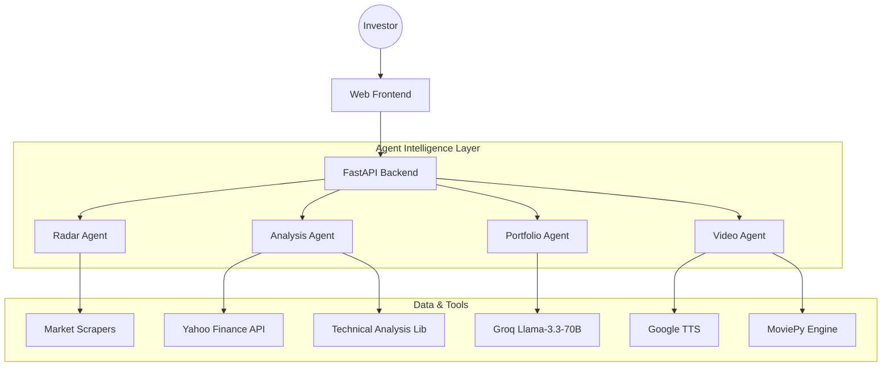

# Architecture: AI Indian Investor

This document outlines the multi-agent architecture and technical implementation of the AI Indian Investor platform, developed for the ET AI Hackathon 2026.

## System Overview

The platform uses a **decoupled multi-agent architecture** where specialized agents collaborate to provide market intelligence. Each agent is responsible for a specific domain, ensuring high reliability and specialized logic.

## Agent Roles & Responsibilities

### 1. Radar Agent (`radar_agent.py`)
- **Role**: Opportunity Scanner.
- **Responsibility**: Monitors bulk deals, insider trading, and volume spikes.
- **Logic**: Filters noise from corporate filings to find high-conviction signals (e.g., Promoter buying or 5x volume surges).

### 2. Analysis Agent (`analysis_agent.py`)
- **Role**: Technical Analyst.
- **Responsibility**: Fetches historical data and calculates technical indicators (RSI, MACD, SMA).
- **Logic**: Detects chart patterns like "Bull Flags" or "Cup and Handles" with associated confidence scores and success rates.

### 3. Portfolio Agent (`portfolio_agent.py`)
- **Role**: Investment Advisor (LLM).
- **Responsibility**: Orchestrates user conversations using **Groq's Llama-3.3-70B**.
- **Logic**: Combines market context with user risk profiles to provide specific, data-backed insights with source citations.

### 4. Video Agent (`video_builder.py`)
- **Role**: Content Creator.
- **Responsibility**: Generates automated market summary videos.
- **Logic**: Synthesizes a market script (gTTS) and composites it with dynamic charts generated from live data (MoviePy).

## Communication Protocol

1.  **Request Flow**: All communication is asynchronous via FastAPI.
2.  **State Management**: The backend maintains session history for the Portfolio Agent to ensure context-aware advice.
3.  **Background Tasks**: Long-running processes (like video generation) are handled as background tasks, returning a `job_id` for status polling.

## Data Integration & Tooling

| Tool | Usage |
| :--- | :--- |
| **yfinance** | Primary source for real-time and historical NSE stock data. |
| **ta (Technical Analysis)** | Library used for computing financial indicators. |
| **Groq API** | Ultra-fast inference for Llama-3.3-70B model. |
| **MoviePy & gTTS** | Video compositing and AI voiceover generation. |

## Error Handling & Resiliency

A core requirement of the platform is **100% Availability**. We achieve this through:

-   **Mock Fallbacks**: Every agent has a built-in mock mode. If an API (like Groq or yfinance) is unavailable or the API key is missing, the agent falls back to high-quality simulated data to ensure the demo never fails.
-   **Validation Layers**: Pydantic models validate all incoming requests to prevent malformed data from crashing the pipelines.
-   **Asynchronous Processing**: Prevents blocking of the main thread during heavy computations or IO-bound tasks.
